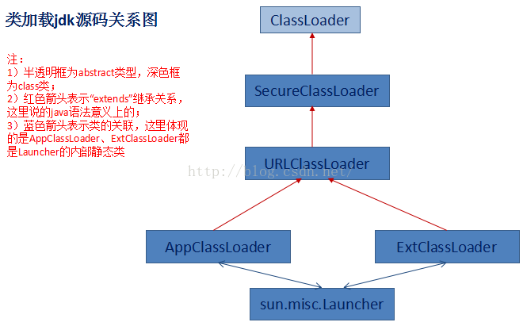
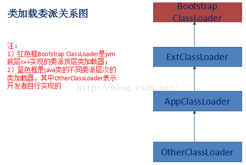

# 模板方法
模板方法模式用于定义构建某个对象的步骤与顺序，或者定义一个算法的骨架。

模板方法不只是单纯的抽象类继承，而是将算法的骨架定义到父类当中，而将
算法具体的实现细节交由子类来进行实现；

# 具体实现
先看mobile包下的具体实现：

还是以手机举例，首先先定义一个Mobile的抽象父类，其中包含了当前整个手机的
制造过程production()方法(先设计手机颜色，再定制品牌LOGO，再安装处理器等);
这样的一个生产步骤已经设计好了以后，子类需要做的就是什么？

继承当前Mobile父类，提供具体方法的定制化，比如OPPO手机可以设置颜色为红色，小米手机
可以设置颜色为黑色，但是无论子类如何定制自己手机品牌的颜色，以及处理器；最终在生产手机时
还是必须按照父类所已经设计好的生产顺序来执行；

这就是模板模式，也是对抽象类的一个不同的运用方式，通过在父类中定义好一系列的算法过程，
然后算法所对应的具体实现步骤则由子类来实现；子类只能影响算法的某一个执行步骤，
但不能影响最终的执行顺序；

# 总结
目前来看父类的使用场景一般情况下有以下两种：

> 1、父类辅助于子类：继承父类的一系列公共方法，然后子类只需要直接调用即可，不需要重复的实现该方法了；

>2、子类辅助于父类：由父类来定义算法执行骨架，然后子类来对算法进行具体实现，最终还是调用父类的算法骨架
来完成所要执行的过程；通过各个不同子类对具体的算法实现不同，以此达到不同的算法执行效果；

在实际的项目研发过程中，都可以深入的思考一下你在此处所使用父类的目的是属于那两种方式？为什么？
为什么此处使用第一种方式更好些？为什么不使用第二种方式？反之亦然；

# 题外话（ClassLoader双亲委派机制）
根据上述介绍相信大家都已经对模板方法有了一个自身的认知，此时关于模板方法的说明应该是一个要结束了的话题了，
但是在Java里面有一个东西不得不提一下的就是JDK的类加载机制，这个相信很多很多的小伙伴至少也是听说过的，而
这个JDK的类加载机制实际上就是一个再合适不过的模板方法的一个使用案例了；

## 关于ClassLoader的简单说明



通过以上类加载的JDK源码图可以看到ClassLoader是类加载机制中的顶层父类；
AppClassLoader以及ExtClassLoader都间接继承了该父类，且都实现了

----



1、Bootstrap ClassLoder：加载的是System.getProperty("sun.boot.class.path");

2、ExtClassLoader：加载的是System.getProperty("java.ext.dirs") & JAVA_HOME/lib/ext目录下的jar

3、AppClassLoader：加载的是System.getProperty("java.class.path")

通过上述类加载机制委派图也知，OtherClassLoader（用户自定义的ClassLoader)默认的父类加载器就是AppClassLoader；


### ClassLoader相关源码

```
private static native void registerNatives();
    static {
        registerNatives();
    }
    
//native方法用来调用BootStrapClassLoader类加载器
private final ClassLoader parent;

private native final Class<?> findLoadedClass0(String name);

protected final Class<?> findLoadedClass(String name) {
        if (!checkName(name))
            return null;
        return findLoadedClass0(name);
    }
    
 //ClassLoader加载类时所执行的方法
protected Class<?> loadClass(String name, boolean resolve)
        throws ClassNotFoundException
    {
        synchronized (getClassLoadingLock(name)) {
            //调用native的findLoadedClass()方法，用来判断当前该类是否已经被加载过了
            Class<?> c = findLoadedClass(name);
            if (c == null) {
                long t0 = System.nanoTime();
                try {
                    if (parent != null) {
                        c = parent.loadClass(name, false);
                    } else {
                        c = findBootstrapClassOrNull(name);
                    }
                } catch (ClassNotFoundException e) {
                    // ClassNotFoundException thrown if class not found
                    // from the non-null parent class loader
                }

                if (c == null) {
                    // If still not found, then invoke findClass in order
                    // to find the class.
                    long t1 = System.nanoTime();
                    c = findClass(name);

                    // this is the defining class loader; record the stats
                    sun.misc.PerfCounter.getParentDelegationTime().addTime(t1 - t0);
                    sun.misc.PerfCounter.getFindClassTime().addElapsedTimeFrom(t1);
                    sun.misc.PerfCounter.getFindClasses().increment();
                }
            }
            if (resolve) {
                resolveClass(c);
            }
            return c;
        }
    }
```